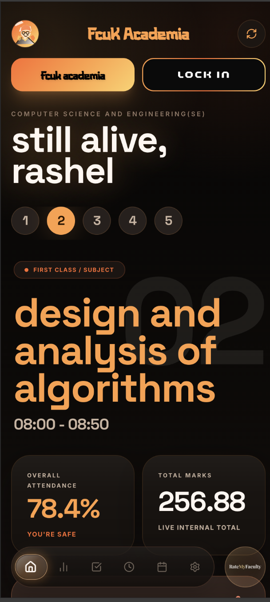
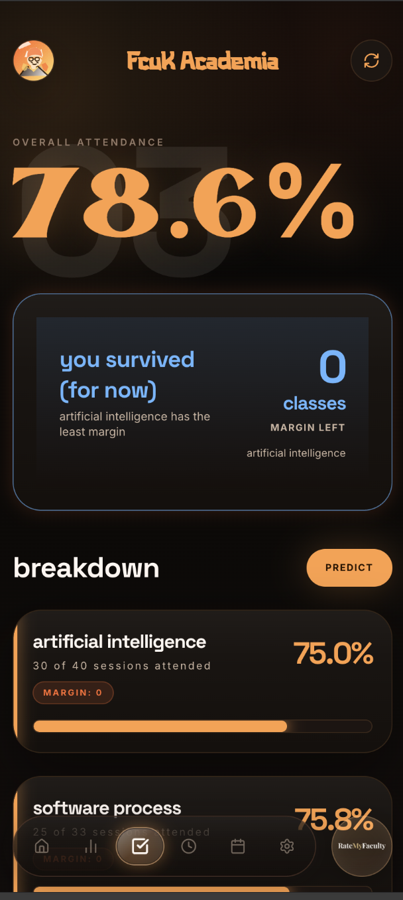
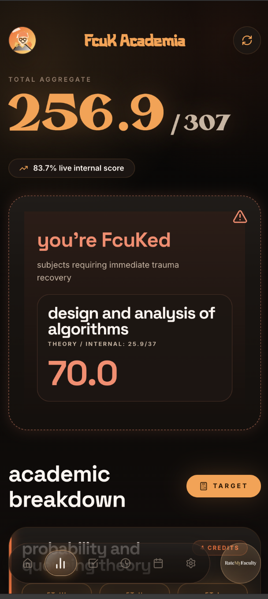
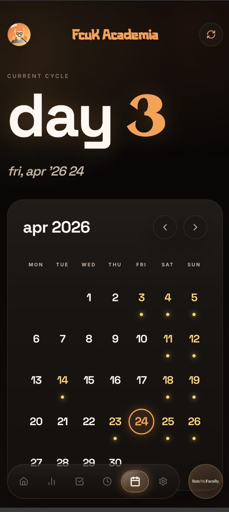
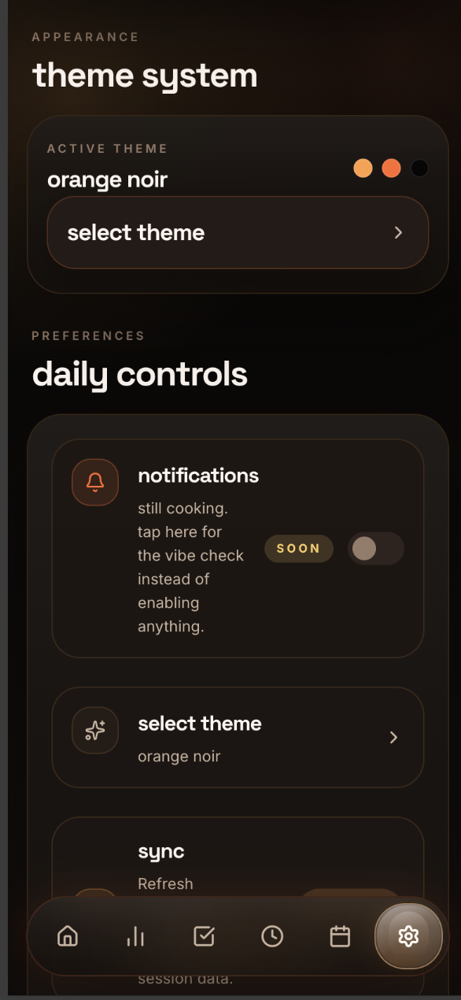
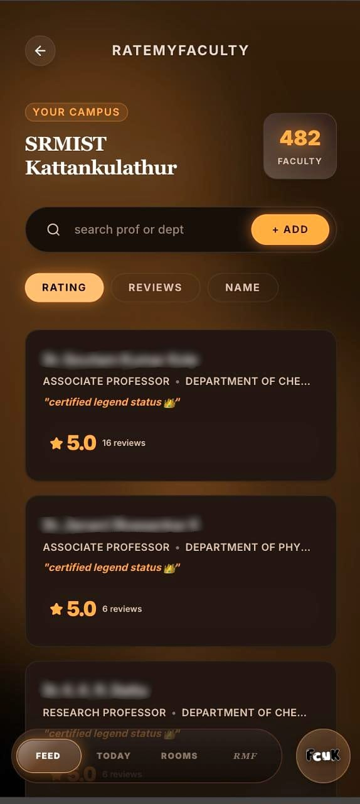
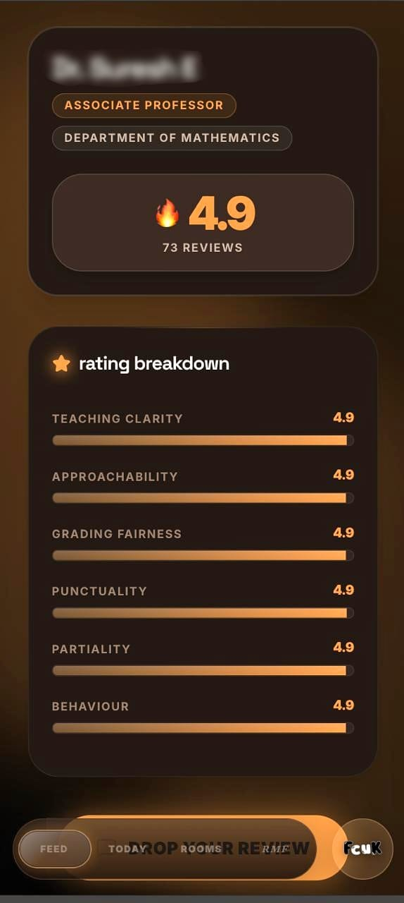
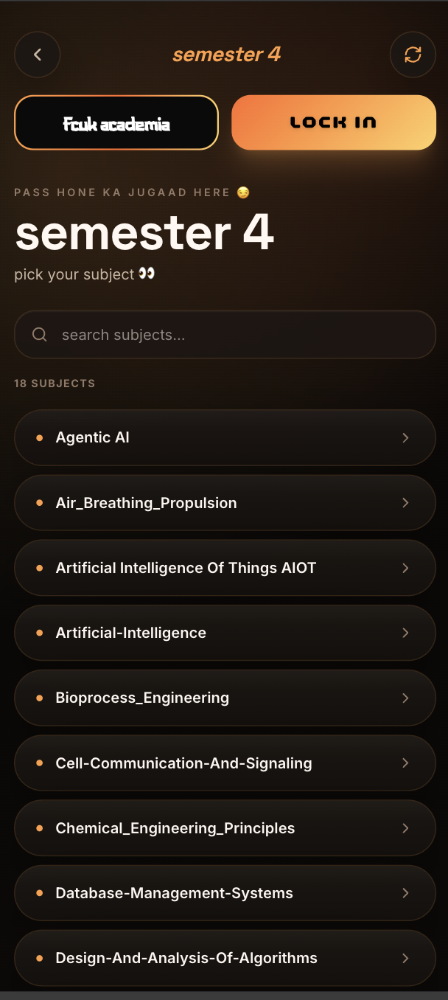

# FcuK Academia
### Academia Redefined. Premium. Personal. Mobile-First.

[](https://nextjs.org/)
[](https://tailwindcss.com/)
[](https://reactjs.org/)
[](https://vercel.com/)

---

**FcuK Academia** is an unofficial, high-performance web dashboard for the **SRMIST Academia Portal**. Built with **Next.js 15+** and **Tailwind CSS 4**, it transforms the clunky academic experience into a sleek, modern, and information-dense dashboard that respects your time.

</div>

---

## ⚡ Core Capabilities

- **🧠 Smart Timetable** — Automatically tracks the **Day Order** and shows your current class, next class, or upcoming schedule with pinpoint accuracy.
- **📈 Attendance Recovery System** — Instantly see your overall attendance and know exactly when you're in **'Safe'** or **'Recovery'** mode (75% threshold).
- **📝 Real-time Marks** — Live internal mark totals and **'Academic Alerts'** for subjects that need your immediate attention.
- **🗓️ Integrated Planner** — Check your monthly calendar, university events, and day order mapping in one unified view.
- **✨ Premium UI/UX** — 
    - **Liquid Glass Design**: iOS26-inspired glassmorphism with neon accents.
    - **Micro-animations**: Powered by **Framer Motion** and **Lottie**.
    - **Mobile First**: Designed specifically for the student on the move.

---

## 📱 Visual Preview

<div align="center">
  <table>
    <tr>
      <td align="center" width="33%">
        <br/>
        <sub><b>Smart Dashboard</b></sub>
      </td>
      <td align="center" width="33%">
        <br/>
        <sub><b>Attendance Tracker</b></sub>
      </td>
      <td align="center" width="33%">
        <br/>
        <sub><b>Live Timetable</b></sub>
      </td>
    </tr>
    <tr>
      <td align="center" width="33%">
        <br/>
        <sub><b>Academic Marks</b></sub>
      </td>
      <td align="center" width="33%">
        <br/>
        <sub><b>Event Planner</b></sub>
      </td>
      <td align="center" width="33%">
        <br/>
        <sub><b>Personalization</b></sub>
      </td>
    </tr>
    <tr>
     <td align="center" width="33%">
        <br/>
        <sub><b>Rate My Faculty</b></sub>
      </td>
       <td align="center" width="33%">
        <br/>
        <sub><b>Ratings</b></sub>
      </td>
       <td align="center" width="33%">
        <br/>
        <sub><b>Lock In</b></sub>
      </td>
    </tr>
  </table>

  <br/>
  <i>Sleek. Dark. Information-dense. Premium experiences for SRM students.</i>
</div>

---

## 🚀 Getting Started

### Prerequisites
- **Node.js**: `v20.9.0` or higher
- **Academia Credentials**: Required for live data extraction.

### Installation

1. **Clone the repository:**
   ```bash
   git clone https://github.com/yourusername/fcuk-app.git
   cd fcuk-app
   ```

2. **Install dependencies:**
   ```bash
   npm install
   ```

3. **Run the development server:**
   ```bash
   npm run dev
   ```

4. **Launch:**
   Open [http://localhost:3000](http://localhost:3000) with your browser.

---

## ⚖️ Disclaimer & Privacy

> [!CAUTION]
> **Disclaimer**: This is an **unofficial** third-party application and is **not** endorsed by, affiliated with, or maintained by **SRM Institute of Science and Technology (SRMIST)**. Use this application responsibly.

**Privacy**: All data is retrieved directly from the Academia portal. We do **not** store your credentials or personal academic data on any external servers. This is a client-side focused dashboard for personal academic management.

---

<div align="center">

### *Study. Survive. Repeat.*
Designed with ❤️ for the student community.

*FCUK stands for Fully Controlled University Kit*

</div>
